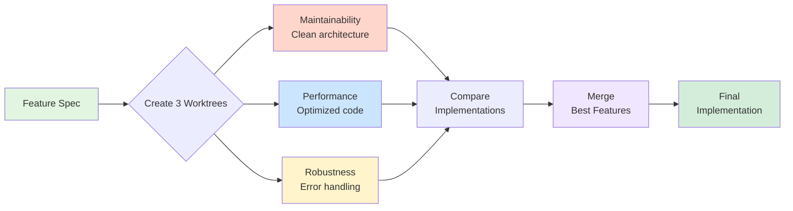

# Referee Pattern with Claude Code

<div align="center">

**A [Vibe Academy](https://www.vibe.academy/) Learning Tool**

*Master multi-perspective problem-solving through AI-powered code generation*

---

</div>

A template project demonstrating the **Referee Pattern** - a powerful workflow for generating multiple implementations of the same feature, each optimized for a different quality attribute, then merging the best approaches.

## What is the Referee Pattern?

The Referee Pattern is a code generation workflow where:
1. Multiple implementations of the same feature are generated in parallel
2. Each implementation focuses on a specific quality attribute (maintainability, performance, robustness, etc.)
3. The implementations are evaluated and the best aspects are merged into a final solution

This approach combines diverse perspectives to create code that is:
- Maintainable (clean architecture, extensible)
- Performant (optimized, efficient)
- Robust (error handling, edge cases)

### Visual Overview



**See [VISUAL_GUIDE.md](./VISUAL_GUIDE.md) for detailed diagrams and flowcharts.**

## Quick Start

### Prerequisites

- [Claude Code CLI](https://docs.anthropic.com/en/docs/claude-code) installed
- Git installed
- Python 3.13+ with `uv` package manager

### Get Started

1. **Clone the repository:**
   ```bash
   git clone <your-repo-url>
   cd referee-pattern
   ```

2. **Create worktrees for each implementation approach:**
   ```bash
   git worktree add -b robustness-impl ../referee-pattern-robustness
   git worktree add -b maintainability-impl ../referee-pattern-maintainability
   git worktree add -b performance-impl ../referee-pattern-performance
   ```

3. **In each worktree, start Claude and run the corresponding slash command:**
   ```bash
   # Terminal 1: Robustness implementation
   cd ../referee-pattern-robustness
   claude
   > /robustness

   # Terminal 2: Maintainability implementation
   cd ../referee-pattern-maintainability
   claude
   > /maintainability

   # Terminal 3: Performance implementation
   cd ../referee-pattern-performance
   claude
   > /performance
   ```

4. **Verify each implementation:**
   ```bash
   uv run behave
   # Should show: 5 scenarios passed, 15 steps passed
   ```

5. **Compare and merge the best aspects** from each implementation.

> **New to git worktrees?** See [WORKTREES.md](./WORKTREES.md) for a complete guide.

---

## Project Structure

```
referee-pattern/
├── .claude/
│   ├── agents/          # Code review agents (for reviewing existing code)
│   │   ├── maintainability.md
│   │   ├── performance.md
│   │   ├── robustness.md
│   │   └── ...
│   └── commands/        # Slash commands (for generating implementations)
│       ├── maintainability.md   # /maintainability
│       ├── performance.md       # /performance
│       ├── robustness.md        # /robustness
│       ├── readability.md       # /readability
│       ├── security.md          # /security
│       └── testing.md           # /testing
├── features/            # BDD specifications
│   ├── calculator.feature
│   └── steps/
│       └── calculator_steps.py
├── docs/
│   └── ARCHITECTURE_EVOLUTION.md  # Why this architecture exists
└── PATTERN.md           # Detailed pattern explanation
```

## Slash Commands

Run these in Claude Code to generate implementations:

| Command | Focus | Typical Output |
|---------|-------|----------------|
| `/robustness` | Error handling, validation, edge cases | Custom exceptions, defensive code |
| `/maintainability` | Clean architecture, SOLID principles | Multiple files, Strategy pattern |
| `/performance` | Speed, memory efficiency | `__slots__`, minimal abstraction |
| `/readability` | Clarity, self-documentation | Comprehensive docstrings |
| `/security` | Input validation, type safety | Strict validation, bounds checking |
| `/testing` | Testability, dependency injection | Injectable dependencies |

Each command:
1. Reads all `.feature` files in `features/`
2. Creates implementation in `src/`
3. Updates step definitions
4. Runs `uv run behave` to verify

## Review Agents

The `.claude/agents/` directory contains code review agents for evaluating existing code:

```
Use the robustness agent to review src/calculator.py
```

These are separate from the slash commands - they review code, they don't generate it.

## The Challenge: Calculator Implementation

This template includes a feature spec for a simple calculator that demonstrates the Referee Pattern in action.

**The Problem:** Build a calculator that handles basic arithmetic (add, subtract, multiply, divide) and division by zero errors.

**Success Criteria:** `uv run behave` passes: 5 scenarios, 15 steps

## When to Use This Pattern

The Referee Pattern is ideal for:
- Features with competing quality attributes (performance vs. maintainability)
- Complex problems that benefit from multiple perspectives
- Learning opportunities - see different approaches to the same problem
- Architecture decisions - evaluate tradeoffs empirically

Not recommended for:
- Simple, trivial tasks
- Time-critical situations (requires more upfront work)
- Problems with one obvious solution

## Learn More

### Core Documentation
- [PATTERN.md](./PATTERN.md) - Detailed explanation of the referee pattern
- [VISUAL_GUIDE.md](./VISUAL_GUIDE.md) - Diagrams, flowcharts, and visual walkthroughs
- [WORKTREES.md](./WORKTREES.md) - Git worktrees explained
- [MERGE_GUIDE.md](./MERGE_GUIDE.md) - Step-by-step guide for merging implementations
- [SUCCESS_CRITERIA.md](./SUCCESS_CRITERIA.md) - Completion checklist and verification steps
- [TROUBLESHOOTING.md](./TROUBLESHOOTING.md) - Common issues and solutions

### Architecture
- [docs/ARCHITECTURE_EVOLUTION.md](./docs/ARCHITECTURE_EVOLUTION.md) - **Why slash commands instead of agents** (hallucination issues, tool use failures, and the evolution to the current design)

### Example Implementations
- [examples/](./examples/) - Reference merge implementations with rationale
  - [Strategy A: Architectural Base](./examples/merge-strategies/strategy-a/)
  - [Strategy B: Performance Core](./examples/merge-strategies/strategy-b/)
  - [Strategy C: Balanced Synthesis](./examples/merge-strategies/strategy-c/)

## Continue Learning

Want to level up your coding skills even further? Check out
[How to Read Code](https://www.vibe.academy/how-to-read-code) - a comprehensive
course from Vibe Academy that teaches you the essential skill of understanding
and navigating codebases like a pro.

## License

This is a template project - use it however you like!

---

<div align="center">

**Made with care by [Vibe Academy](https://www.vibe.academy/)**

*Empowering developers through practical, hands-on learning*

</div>
