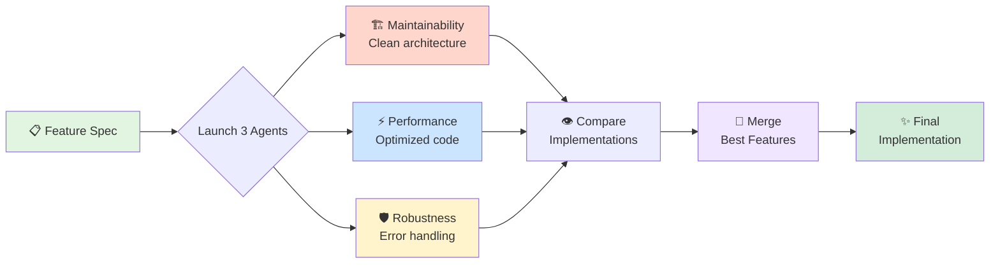

# Referee Pattern with Claude Code

A template project demonstrating the **Referee Pattern** - a powerful workflow for using multiple specialized Claude Code agents to solve problems from different perspectives, then merging the best approaches.

## What is the Referee Pattern?

The Referee Pattern is a code generation workflow where:
1. Multiple specialized agents independently implement the same feature
2. Each agent focuses on a specific quality attribute (maintainability, performance, robustness, etc.)
3. The implementations are evaluated and the best aspects are merged into a final solution

This approach combines diverse perspectives to create code that is:
- ✅ Maintainable (clean architecture, extensible)
- ✅ Performant (optimized, efficient)
- ✅ Robust (error handling, edge cases)

### Visual Overview



**See [VISUAL_GUIDE.md](./VISUAL_GUIDE.md) for detailed diagrams and flowcharts.**

## Quick Start

### Prerequisites

- [Claude Code CLI](https://docs.claude.com/en/docs/claude-code) installed
- Anthropic API key set in your environment

### Get Started in 60 Seconds

1. **Clone the repository:**
   ```bash
   git clone <your-repo-url>
   cd referee-pattern
   ```

2. **Start Claude Code:**
   ```bash
   claude code
   ```

3. **Paste this prompt:**
   ```
   Use the maintainability, performance, and robustness coding agents to solve
   the spec, then use the merge-critic agent to put the best bits into a final
   solution. Make sure the specs pass against the final solution.
   ```

4. **Watch the magic happen:**
   - Claude Code automatically orchestrates three specialized agents in parallel
   - Each agent implements the calculator spec from their perspective
   - The merge-critic agent analyzes and combines the best approaches
   - Tests are verified against the final solution

5. **Review the results:**
   - Read the merge analysis and rationale
   - See which approaches were selected and why
   - Verify all tests pass: 5 scenarios, 15 steps ✅

That's it! Claude Code handles all the git worktrees, parallel execution, and merging automatically.

> **New to git worktrees?** See [WORKTREES.md](./WORKTREES.md) for a complete guide on what they are, why we use them, common errors, and troubleshooting tips.

---

## Project Structure

```
referee-pattern/
├── .claude/
│   └── agents/          # Specialized code review agents
│       ├── maintainability.md
│       ├── performance.md
│       ├── robustness.md
│       ├── readability.md
│       ├── security.md
│       └── testing.md
├── features/            # BDD specifications
│   ├── calculator.feature
│   └── steps/
│       └── calculator_steps.py  # TODO: Implement these!
└── PATTERN.md          # Detailed pattern explanation
```

## The Challenge: Calculator Implementation

This template includes a feature spec for a simple calculator that demonstrates the Referee Pattern in action.

**The Problem:** Build a calculator that handles basic arithmetic (add, subtract, multiply, divide) and division by zero errors.

**How It Works:**
1. Three specialized agents independently implement the calculator:
   - **Maintainability agent** - Clean architecture, SOLID principles
   - **Performance agent** - Speed and memory efficiency
   - **Robustness agent** - Error handling and edge cases
2. Claude Code orchestrates them in parallel automatically
3. The merge-critic agent analyzes and combines the best approaches
4. The final solution is tested and verified

**Success Criteria:** All tests pass: 5 scenarios, 15 steps ✅

## The Specialized Agents

The \`.claude/agents/\` directory contains 6 specialized code review agents:

1. **maintainability** - Clean architecture, SOLID principles, extensibility
2. **performance** - Speed, memory efficiency, algorithmic optimization
3. **robustness** - Error handling, edge cases, defensive programming
4. **readability** - Code clarity, documentation, naming
5. **security** - Vulnerabilities, input validation, secure practices
6. **testing** - Test coverage, test quality, testability

These agents can be used with Claude Code's \`/agents\` command or the Task tool.

## When to Use This Pattern

The Referee Pattern is ideal for:
- ✅ Features with competing quality attributes (performance vs. maintainability)
- ✅ Complex problems that benefit from multiple perspectives
- ✅ Learning opportunities - see different approaches to the same problem
- ✅ Code review - generate implementations optimized for different concerns
- ✅ Architecture decisions - evaluate tradeoffs empirically

Not recommended for:
- ❌ Simple, trivial tasks
- ❌ Time-critical situations (requires more upfront work)
- ❌ Problems with one obvious solution

## Learn More

### Core Documentation
- [PATTERN.md](./PATTERN.md) - Detailed explanation of the referee pattern
- [VISUAL_GUIDE.md](./VISUAL_GUIDE.md) - **Diagrams, flowcharts, and visual walkthroughs**
- [WORKTREES.md](./WORKTREES.md) - **Git worktrees explained: what they are, why we use them, and how to use them**
- [MERGE_GUIDE.md](./MERGE_GUIDE.md) - **Step-by-step guide for merging implementations**
- [AGENT_USAGE_GUIDE.md](./AGENT_USAGE_GUIDE.md) - **How to use specialized agents with template prompts**
- [SUCCESS_CRITERIA.md](./SUCCESS_CRITERIA.md) - **Completion checklist and verification steps**
- [TROUBLESHOOTING.md](./TROUBLESHOOTING.md) - **Common issues and solutions**

### Example Implementations
- [examples/](./examples/) - **Reference merge implementations with rationale**
  - [Strategy A: Architectural Base](./examples/merge-strategies/strategy-a/) - Maintainability-first with performance features
  - [Strategy B: Performance Core](./examples/merge-strategies/strategy-b/) - Speed-first with essential safety
  - [Strategy C: Balanced Synthesis](./examples/merge-strategies/strategy-c/) - Pragmatic middle ground
  - [STRATEGY_COMPARISON.md](./examples/STRATEGY_COMPARISON.md) - **Choose the right strategy for your context**

### Additional Resources
- [.claude/agents/README.md](./.claude/agents/README.md) - Agent descriptions
- [Claude Code Documentation](https://docs.claude.com/en/docs/claude-code)

## License

This is a template project - use it however you like!
