# Referee Pattern with Claude Code

A template project demonstrating the **Referee Pattern** - a powerful workflow for using multiple specialized Claude Code agents to solve problems from different perspectives, then merging the best approaches.

## What is the Referee Pattern?

The Referee Pattern is a code generation workflow where:
1. Multiple specialized agents (like "referees") independently implement the same feature
2. Each agent focuses on a specific quality attribute (maintainability, performance, robustness, etc.)
3. The implementations are evaluated and the best aspects are merged into a final solution

This approach combines diverse perspectives to create code that is:
- ✅ Maintainable (clean architecture, extensible)
- ✅ Performant (optimized, efficient)
- ✅ Robust (error handling, edge cases)

### Visual Overview

```mermaid
graph LR
    Start[📋 Feature Spec] --> Parallel{Launch 3 Agents}

    Parallel --> M[🏗️ Maintainability<br/>Clean architecture]
    Parallel --> P[⚡ Performance<br/>Optimized code]
    Parallel --> R[🛡️ Robustness<br/>Error handling]

    M --> Compare[👁️ Compare<br/>Implementations]
    P --> Compare
    R --> Compare

    Compare --> Merge[🔀 Merge<br/>Best Features]
    Merge --> Final[✨ Final<br/>Implementation]

    style Start fill:#e1f5e1
    style M fill:#ffd6cc
    style P fill:#cce5ff
    style R fill:#fff4cc
    style Merge fill:#f0e6ff
    style Final fill:#d4edda
```



**See [VISUAL_GUIDE.md](./VISUAL_GUIDE.md) for detailed diagrams and flowcharts.**

## Quick Start

### Prerequisites

- [Claude Code CLI](https://docs.claude.com/en/docs/claude-code) installed
- Anthropic API key set in your environment

### Get Started in 60 Seconds

1. **Clone the repository:**
   ```bash
   git clone <your-repo-url>
   cd referee-pattern
   ```

2. **Start Claude Code:**
   ```bash
   claude code
   ```

3. **Paste this prompt:**
   ```
   Use the maintainability, performance, and robustness coding agents to solve
   the spec, then use the merge-critic agent to put the best bits into a final
   solution. Make sure the specs pass against the final solution.
   ```

4. **Watch the magic happen:**
   - Claude Code automatically orchestrates three specialized agents in parallel
   - Each agent implements the calculator spec from their perspective
   - The merge-critic agent analyzes and combines the best approaches
   - Tests are verified against the final solution

5. **Review the results:**
   - Read the merge analysis and rationale
   - See which approaches were selected and why
   - Verify all tests pass: 5 scenarios, 15 steps ✅

That's it! Claude Code handles all the git worktrees, parallel execution, and merging automatically.

---

## Understanding Git Worktrees

**New to git worktrees?** This section explains what they are and why we use them.

### What's a Git Worktree?

A worktree lets you check out multiple branches simultaneously in different directories. Instead of switching branches with `git checkout`, you have multiple copies of your repo, each on a different branch, all sharing the same git history.

**Normal Git:**
```
my-repo/  (on main branch)
# To work on feature: git checkout feature-branch
# Can't work on multiple branches simultaneously
```

**With Worktrees:**
```
my-repo/                           (main branch)
my-repo-maintainability/           (maintainability-impl branch)
my-repo-performance/               (performance-impl branch)
my-repo-robustness/                (robustness-impl branch)
# Work on all branches simultaneously!
```

### Why Worktrees for Referee Pattern?

The Referee Pattern needs three agents working in parallel. Worktrees provide:

✅ **Isolation** - Each agent has its own workspace, no conflicts
✅ **Parallel Work** - All agents can work simultaneously
✅ **Easy Comparison** - Open all implementations side-by-side
✅ **Git Integration** - All changes tracked in branches
✅ **Clean Merging** - Compare and merge systematically

**Alternative: Why not just branches?**
You could use branches, but you'd need to:
- Constantly switch between branches (`git checkout`)
- Can't compare implementations side-by-side easily
- Risk mixing up which branch you're on
- Can't work in parallel (agents would conflict)

### Common Worktree Errors

**Error: `fatal: '../referee-pattern-maintainability' already exists`**

This means a previous worktree wasn't cleaned up.

```bash
# Solution: Remove the directory and try again
rm -rf ../referee-pattern-maintainability
git worktree add -b maintainability-impl ../referee-pattern-maintainability
```

**Error: `fatal: 'maintainability-impl' is already checked out`**

The branch exists in another worktree.

```bash
# Solution 1: List all worktrees to find where it's checked out
git worktree list

# Solution 2: Remove that worktree first
git worktree remove ../referee-pattern-maintainability

# Solution 3: Delete the branch if you want to start fresh
git branch -D maintainability-impl
```

**Error: `fatal: invalid reference: maintainability-impl`**

The branch doesn't exist yet but you're trying to check it out.

```bash
# Solution: Use -b flag to create the branch
git worktree add -b maintainability-impl ../referee-pattern-maintainability
```

### Worktree Cheat Sheet

```bash
# Create worktree with new branch
git worktree add -b <branch-name> <path>

# Create worktree from existing branch
git worktree add <path> <existing-branch>

# List all worktrees
git worktree list

# Remove worktree
git worktree remove <path>

# Remove worktree forcefully (if it has uncommitted changes)
git worktree remove <path> --force

# Clean up stale worktrees
git worktree prune

# Move a worktree
git worktree move <old-path> <new-path>
```

### Cleanup After Completion

To clean up worktrees created during the Referee Pattern:

```bash
# Remove worktrees
git worktree remove ../referee-pattern-maintainability --force
git worktree remove ../referee-pattern-performance --force
git worktree remove ../referee-pattern-robustness --force

# Remove branches (optional - only if you want to start fresh)
git branch -D maintainability-impl
git branch -D performance-impl
git branch -D robustness-impl

# Clean up any stale references
git worktree prune
```

### FAQ

**Q: Do worktrees use more disk space?**
A: Slightly. They share the `.git` directory, so only working files are duplicated. For this project, that's minimal (~few KB per worktree).

**Q: Can I commit from worktrees?**
A: Yes! Each worktree is a full git repository. Commits go to that worktree's branch.

**Q: What happens if I delete a worktree directory manually?**
A: Git still thinks it exists. Run `git worktree prune` to clean up git's references.

**Q: Can worktrees be on different branches of the same repo?**
A: Yes! That's exactly what we do in the Referee Pattern.

**Q: Do I need to create worktrees, or can I use branches?**
A: Worktrees are recommended but not required. You could use branches with `git checkout`, but:
- You'd need to switch constantly
- Can't compare implementations easily
- Agents can't work in parallel
- More prone to mistakes (forgetting which branch you're on)

**Q: Where should I create worktrees?**
A: The convention is to create them as sibling directories:
```
projects/
├── referee-pattern/                    (main repo)
├── referee-pattern-maintainability/    (worktree)
├── referee-pattern-performance/        (worktree)
└── referee-pattern-robustness/         (worktree)
```

This keeps them close but separate.

---

## Project Structure

```
referee-pattern/
├── .claude/
│   └── agents/          # Specialized code review agents
│       ├── maintainability.md
│       ├── performance.md
│       ├── robustness.md
│       ├── readability.md
│       ├── security.md
│       └── testing.md
├── features/            # BDD specifications
│   ├── calculator.feature
│   └── steps/
│       └── calculator_steps.py  # TODO: Implement these!
└── PATTERN.md          # Detailed pattern explanation
```

## The Challenge: Calculator Implementation

This template includes a feature spec for a simple calculator that demonstrates the Referee Pattern in action.

**The Problem:** Build a calculator that handles basic arithmetic (add, subtract, multiply, divide) and division by zero errors.

**How It Works:**
1. Three specialized agents independently implement the calculator:
   - **Maintainability agent** - Clean architecture, SOLID principles
   - **Performance agent** - Speed and memory efficiency
   - **Robustness agent** - Error handling and edge cases
2. Claude Code orchestrates them in parallel automatically
3. The merge-critic agent analyzes and combines the best approaches
4. The final solution is tested and verified

**Success Criteria:** All tests pass: 5 scenarios, 15 steps ✅

## The Specialized Agents

The \`.claude/agents/\` directory contains 6 specialized code review agents:

1. **maintainability** - Clean architecture, SOLID principles, extensibility
2. **performance** - Speed, memory efficiency, algorithmic optimization
3. **robustness** - Error handling, edge cases, defensive programming
4. **readability** - Code clarity, documentation, naming
5. **security** - Vulnerabilities, input validation, secure practices
6. **testing** - Test coverage, test quality, testability

These agents can be used with Claude Code's \`/agents\` command or the Task tool.

## When to Use This Pattern

The Referee Pattern is ideal for:
- ✅ Features with competing quality attributes (performance vs. maintainability)
- ✅ Complex problems that benefit from multiple perspectives
- ✅ Learning opportunities - see different approaches to the same problem
- ✅ Code review - generate implementations optimized for different concerns
- ✅ Architecture decisions - evaluate tradeoffs empirically

Not recommended for:
- ❌ Simple, trivial tasks
- ❌ Time-critical situations (requires more upfront work)
- ❌ Problems with one obvious solution

## Learn More

### Core Documentation
- [PATTERN.md](./PATTERN.md) - Detailed explanation of the referee pattern
- [VISUAL_GUIDE.md](./VISUAL_GUIDE.md) - **Diagrams, flowcharts, and visual walkthroughs**
- [MERGE_GUIDE.md](./MERGE_GUIDE.md) - **Step-by-step guide for merging implementations**
- [AGENT_USAGE_GUIDE.md](./AGENT_USAGE_GUIDE.md) - **How to use specialized agents with template prompts**
- [SUCCESS_CRITERIA.md](./SUCCESS_CRITERIA.md) - **Completion checklist and verification steps**
- [TROUBLESHOOTING.md](./TROUBLESHOOTING.md) - **Common issues and solutions**

### Example Implementations
- [examples/](./examples/) - **Reference merge implementations with rationale**
  - [Strategy A: Architectural Base](./examples/merge-strategies/strategy-a/) - Maintainability-first with performance features
  - [Strategy B: Performance Core](./examples/merge-strategies/strategy-b/) - Speed-first with essential safety
  - [Strategy C: Balanced Synthesis](./examples/merge-strategies/strategy-c/) - Pragmatic middle ground
  - [STRATEGY_COMPARISON.md](./examples/STRATEGY_COMPARISON.md) - **Choose the right strategy for your context**

### Additional Resources
- [.claude/agents/README.md](./.claude/agents/README.md) - Agent descriptions
- [Claude Code Documentation](https://docs.claude.com/en/docs/claude-code)

## License

This is a template project - use it however you like!

---

**Built with [Claude Code](https://claude.com/claude-code) 🤖**
