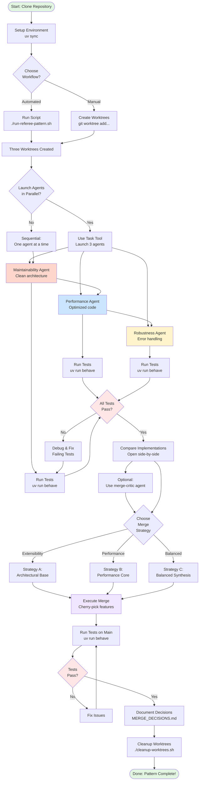
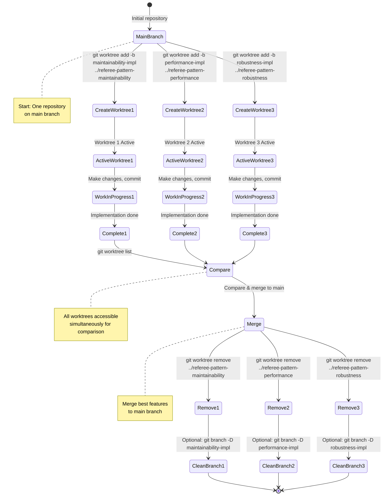
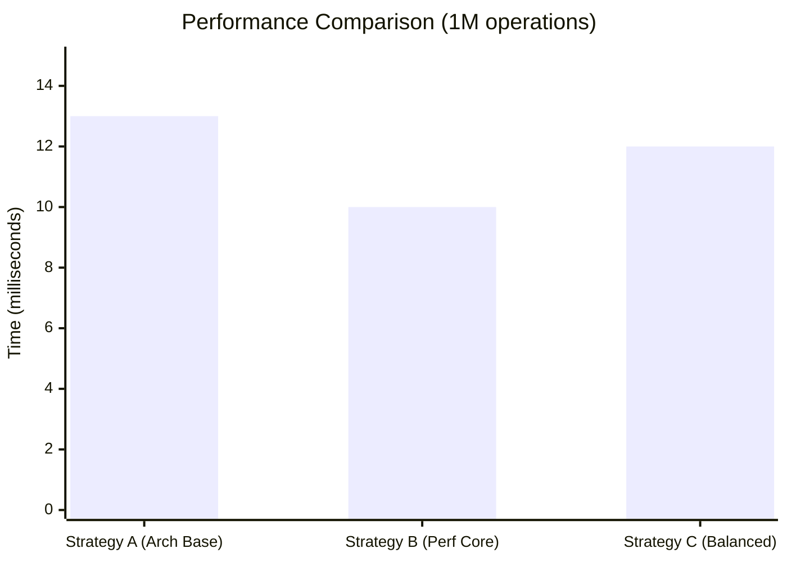
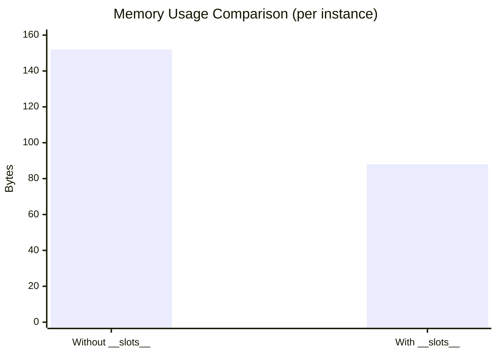
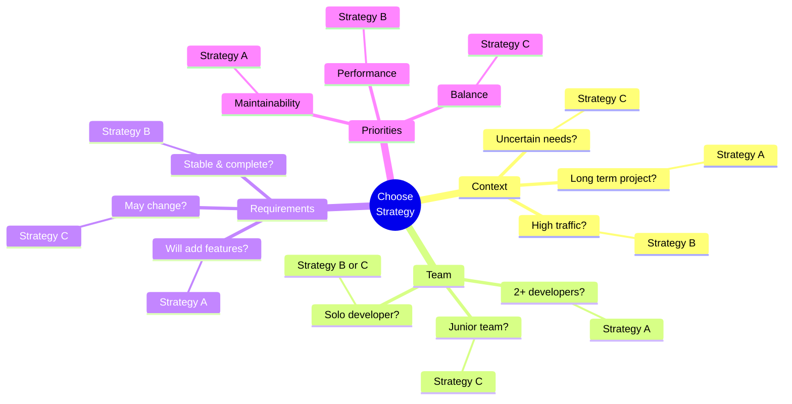

# Visual Guide to the Referee Pattern

This guide provides visual representations of the Referee Pattern workflow, architecture, and decision-making process.

---

## Table of Contents

1. [Workflow Overview](#workflow-overview)
2. [Worktree Structure](#worktree-structure)
3. [Agent Implementation Flow](#agent-implementation-flow)
4. [Merge Strategy Decision Tree](#merge-strategy-decision-tree)
5. [Implementation Comparison](#implementation-comparison)
6. [Git Worktree Operations](#git-worktree-operations)

---

## Workflow Overview

The complete Referee Pattern workflow from setup to final merge.

**Legend:**
- 🟢 Green: Start/End points
- 🔴 Red: Maintainability focus
- 🔵 Blue: Performance focus
- 🟡 Yellow: Robustness focus
- 🟣 Purple: Merge activities
- 🔶 Orange: Decision points

---

## Worktree Structure

How git worktrees organize parallel development.

```mermaid
graph TB
    Main[📁 referee-pattern/<br/>main branch<br/>Base repository]

    Main -.git worktree add.-> M[📁 referee-pattern-maintainability/<br/>maintainability-impl branch<br/>Maintainability Agent workspace]

    Main -.git worktree add.-> P[📁 referee-pattern-performance/<br/>performance-impl branch<br/>Performance Agent workspace]

    Main -.git worktree add.-> R[📁 referee-pattern-robustness/<br/>robustness-impl branch<br/>Robustness Agent workspace]

    M --> MImpl[✅ Implementation:<br/>Strategy pattern<br/>Multi-module<br/>Clean architecture]

    P --> PImpl[✅ Implementation:<br/>__slots__<br/>Direct methods<br/>Single file]

    R --> RImpl[✅ Implementation:<br/>Custom exceptions<br/>Validation<br/>Error handling]

    MImpl -.compare.-> Merge[🔀 Merge to Main<br/>Cherry-pick best features]
    PImpl -.compare.-> Merge
    RImpl -.compare.-> Merge

    Merge --> Final[📁 referee-pattern/<br/>main branch<br/>✨ Final merged implementation]

    style Main fill:#e1f5e1
    style M fill:#ffd6cc
    style P fill:#cce5ff
    style R fill:#fff4cc
    style Merge fill:#f0e6ff
    style Final fill:#d4edda
```

**Key Points:**
- Each worktree is a separate directory
- All worktrees share the same `.git` history
- Agents work in isolation without conflicts
- Easy to compare implementations side-by-side

---

## Agent Implementation Flow

What each specialized agent does during implementation.

```mermaid
sequenceDiagram
    participant User
    participant Maintainability as 🏗️ Maintainability Agent
    participant Performance as ⚡ Performance Agent
    participant Robustness as 🛡️ Robustness Agent
    participant Tests as 🧪 Test Suite

    User->>Maintainability: Launch with template prompt
    User->>Performance: Launch with template prompt
    User->>Robustness: Launch with template prompt

    Note over Maintainability,Robustness: All agents work in parallel

    rect rgb(255, 214, 204)
        Maintainability->>Maintainability: Read BDD specs
        Maintainability->>Maintainability: Design architecture:<br/>- Strategy pattern<br/>- Multi-module<br/>- SOLID principles
        Maintainability->>Maintainability: Implement code
        Maintainability->>Tests: Run behave
        Tests-->>Maintainability: ✅ 5 scenarios passed
        Maintainability->>Maintainability: Document: IMPLEMENTATION_SUMMARY.md
    end

    rect rgb(204, 229, 255)
        Performance->>Performance: Read BDD specs
        Performance->>Performance: Design architecture:<br/>- __slots__<br/>- Single file<br/>- Direct dispatch
        Performance->>Performance: Implement code
        Performance->>Tests: Run behave
        Tests-->>Performance: ✅ 5 scenarios passed
        Performance->>Performance: Document optimizations
    end

    rect rgb(255, 244, 204)
        Robustness->>Robustness: Read BDD specs
        Robustness->>Robustness: Design architecture:<br/>- Custom exceptions<br/>- Validation<br/>- Error handling
        Robustness->>Robustness: Implement code
        Robustness->>Tests: Run behave
        Tests-->>Robustness: ✅ 5 scenarios passed
        Robustness->>Robustness: Document defensive strategies
    end

    Maintainability-->>User: Implementation complete
    Performance-->>User: Implementation complete
    Robustness-->>User: Implementation complete

    Note over User: All three pass same tests<br/>Functionally equivalent<br/>Architecturally different
```

---

## Merge Strategy Decision Tree

Choose the right merge strategy for your context.

```mermaid
flowchart TD
    Start{What matters<br/>most?}

    Start -->|Extensibility| Ext{Will add<br/>operations<br/>frequently?}
    Start -->|Performance| Perf{Need<br/>1000+ ops/sec<br/>throughput?}
    Start -->|Balanced| Bal{Uncertain<br/>requirements?}
    Start -->|Multiple factors| Multi[Read detailed<br/>comparison]

    Ext -->|Yes| StratA[Strategy A:<br/>Architectural Base]
    Ext -->|No| CheckTeam{Large<br/>team?}
    CheckTeam -->|Yes| StratA
    CheckTeam -->|No| StratC[Strategy C:<br/>Balanced]

    Perf -->|Yes| Stable{Requirements<br/>stable?}
    Perf -->|No| StratC
    Stable -->|Yes| StratB[Strategy B:<br/>Performance Core]
    Stable -->|No| StratA

    Bal -->|Yes| StratC
    Bal -->|No| Start

    Multi --> Decision[Use STRATEGY_COMPARISON.md]

    StratA --> FeatA[Features:<br/>✅ Multi-module<br/>✅ Strategy pattern<br/>✅ __slots__<br/>✅ Custom exceptions<br/>📊 ~320 LOC, 4 files]

    StratB --> FeatB[Features:<br/>✅ Single file<br/>✅ Direct methods<br/>✅ __slots__<br/>✅ Key exceptions<br/>📊 ~180 LOC, 1 file]

    StratC --> FeatC[Features:<br/>✅ Moderate structure<br/>✅ Direct methods<br/>✅ __slots__<br/>✅ Custom exceptions<br/>📊 ~220 LOC, 3 files]

    FeatA --> UseCase1[Best for:<br/>- Long-term projects<br/>- Teams 2+ devs<br/>- Evolving needs]

    FeatB --> UseCase2[Best for:<br/>- High-traffic<br/>- Stable requirements<br/>- Small team]

    FeatC --> UseCase3[Best for:<br/>- General purpose<br/>- First-time users<br/>- Flexible needs]

    style StratA fill:#ffd6cc
    style StratB fill:#cce5ff
    style StratC fill:#fff4cc
    style Start fill:#f0e6ff
```

---

## Implementation Comparison

Visual comparison of key differences between agent implementations.

```mermaid
graph LR
    subgraph Maintainability ["🏗️ Maintainability Implementation"]
        direction TB
        MA[Structure:<br/>Multi-module]
        MB[Operations:<br/>Strategy Pattern]
        MC[Memory:<br/>Standard classes]
        MD[Docs:<br/>Extensive]
        MA --> MB --> MC --> MD
    end

    subgraph Performance ["⚡ Performance Implementation"]
        direction TB
        PA[Structure:<br/>Single file]
        PB[Operations:<br/>Direct methods]
        PC[Memory:<br/>__slots__]
        PD[Docs:<br/>Minimal]
        PA --> PB --> PC --> PD
    end

    subgraph Robustness ["🛡️ Robustness Implementation"]
        direction TB
        RA[Structure:<br/>Multi-module]
        RB[Exceptions:<br/>Custom hierarchy]
        RC[Validation:<br/>Comprehensive]
        RD[Logging:<br/>Extensive]
        RA --> RB --> RC --> RD
    end

    subgraph Merged ["✨ Merged Result (Strategy A)"]
        direction TB
        MG1[Structure:<br/>Multi-module ← Maintainability]
        MG2[Operations:<br/>Strategy Pattern ← Maintainability]
        MG3[Memory:<br/>__slots__ ← Performance]
        MG4[Exceptions:<br/>Custom ← Robustness]
        MG5[Docs:<br/>Extensive ← Maintainability]
        MG1 --> MG2 --> MG3 --> MG4 --> MG5
    end

    Maintainability ==>|Structure & Patterns| Merged
    Performance ==>|Memory Optimization| Merged
    Robustness ==>|Error Handling| Merged

    style Maintainability fill:#ffd6cc
    style Performance fill:#cce5ff
    style Robustness fill:#fff4cc
    style Merged fill:#d4edda
```

**Legend:**
- 🟠 Red box: Maintainability agent
- 🔵 Blue box: Performance agent
- 🟡 Yellow box: Robustness agent
- 🟢 Green box: Final merged implementation

---

## Git Worktree Operations

Common worktree commands visualized.

---

## Performance Comparison

Benchmarks for the three strategies.

---

## Decision Framework

Quick reference for choosing a strategy.

---

## Quick Reference: Strategy Comparison

| Aspect | Strategy A | Strategy B | Strategy C |
|--------|-----------|-----------|-----------|
| **Files** | 4 | 1 | 3 |
| **LOC** | ~320 | ~180 | ~220 |
| **Structure** | Multi-module | Single file | Hybrid |
| **Speed** | Good | Fastest | Good |
| **Extensibility** | High | Low | Moderate |
| **Best for** | Teams, long-term | High-traffic, stable | General-purpose |

---

## Next Steps

After reviewing these diagrams:

1. **Understand the workflow** - Follow the flowchart
2. **Create worktrees** - Use the worktree operations guide
3. **Launch agents** - Follow the implementation flow
4. **Choose strategy** - Use the decision tree
5. **Execute merge** - Follow the workflow
6. **Document** - Record your decisions

**For detailed instructions, see:**
- [README.md](./README.md) - Main documentation
- [MERGE_GUIDE.md](./MERGE_GUIDE.md) - Merge process
- [STRATEGY_COMPARISON.md](./examples/STRATEGY_COMPARISON.md) - Detailed comparison

---

**Note:** All diagrams are created using Mermaid and render directly in GitHub. No external images needed!
